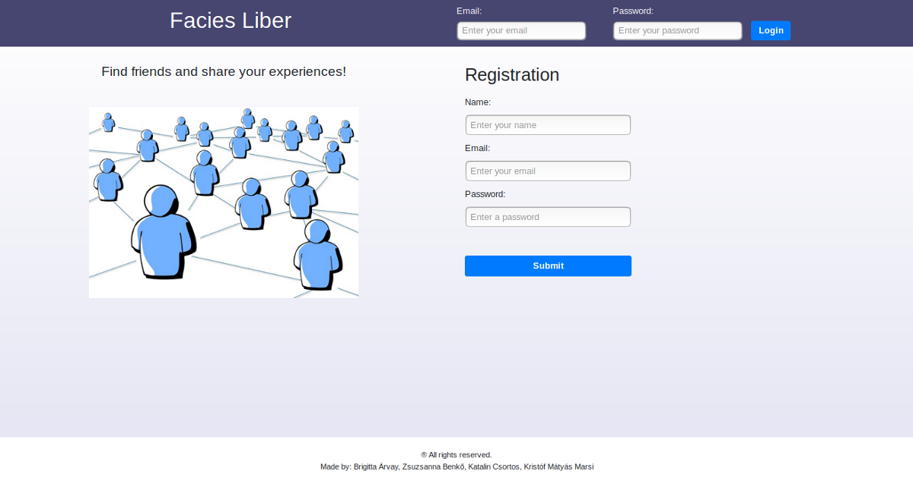
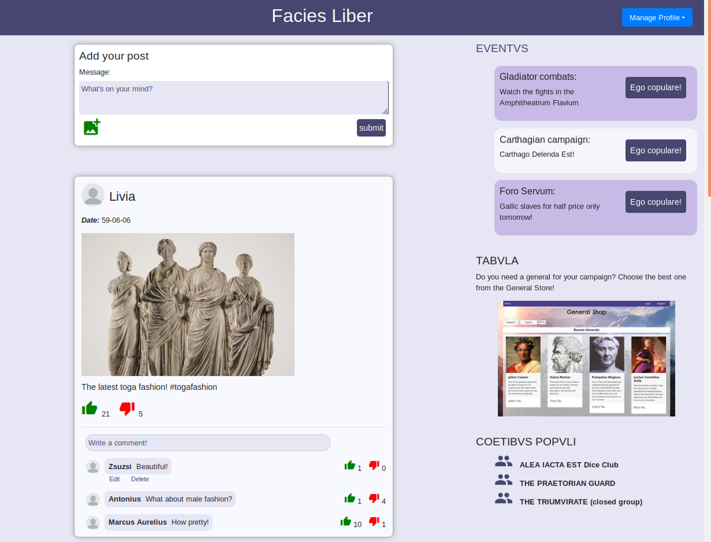
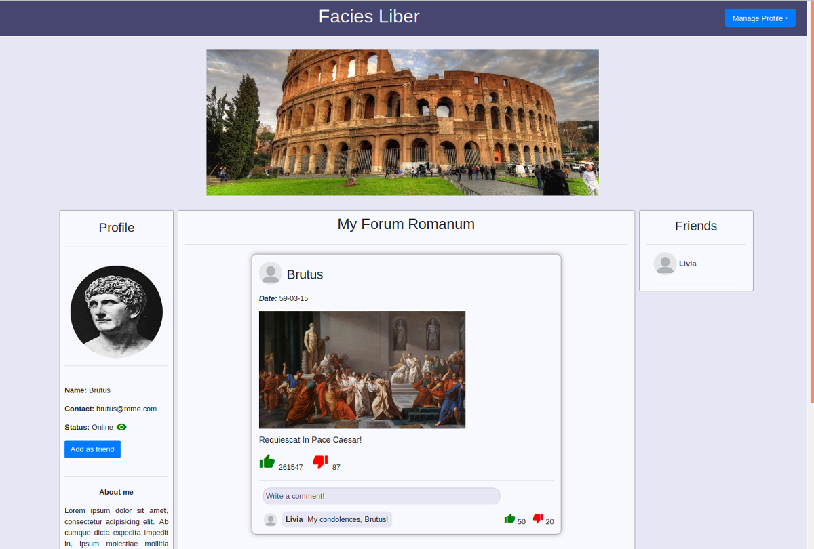

# Facies Liber
## Ancient Roman social network
### by team Compilus Errorus
The assignment was to create  an enterprise-level Java web application with Spring / Spring Boot. Our chosen frontend framework was Angular. This project was our first team work project in Codecool's Enterprise module.

We created the social networking site of ancient Roman times: Facies Liber (Facebook in Latin). Our historical users can write posts, upload pictures, add comments, express their likes or dislikes, edit or delete their own activities, create or join events and, of course, make new friends.

Technologies: Java / Spring Boot, PostgreSQL / Hibernate, Spring Security, JUnit5, Lombok, Angular.

Login / Registration:

Home page:

Profile page:

